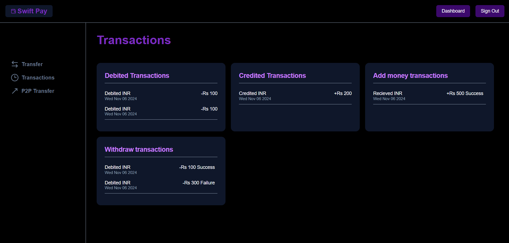

# Swift Pay - An end-to-end wallet

An end-to-end wallet using Next, Postgres, Prisma, Bcrypt, Next-Auth, Tailwind, and Shadcn. It supports on-ramp from the bank, off-ramp to the bank and peer-to-peer transfers. Separate bank webhook handlers ensure transaction safety, high availability, and reliability. Used row-level locking to limit read/write operations to one transaction at a time.


## Table of Contents
- [Live Link](#live-link)
- [Features](#features)
- [Tech Stack](#tech-stack)
- [Installation](#installation)
- [Environment Variables](#environment-variables)
- [Usage](#usage)
- [Screenshots](#screenshots)

## Live Link


```bash
https://swiftpay.rakhshan.online/
```

## Features
- On-ramp transaction from the bank.
- off-ramp transaction to the bank.
- Peer-to-Peer transfers.
- Transactions history.
- Secure authentication and session management using NextAuth.
- Separate Bank webhook handlers

## Tech Stack
- Language: TypeScript
- Frontend: Next.js, Tailwind CSS, and Shadcn
- Backend: Next.js, and Server actions
- Database: PostgreSQL, Prisma ORM
- Authentication: NextAuth

## Installation

### 1. Clone the Repository
First, clone this repository to your local machine:

```bash
git clone https://github.com/your-username/your-repo-name.git
```
### 2. Navigate to the Project Directory
Change into the project directory:

```bash
cd your-repo-name
```

### 3. Install Dependencies
Install the required dependencies using pnpm:

```bash
pnpm install
```

### 4. Migrate Schema

```bash
pnpm dlx prisma migrate dev 
```

### 5. Generate Client

```bash
pnpm dlx prisma generate
```

## Environment Variables
Ensure you set up the following environment variables in a .env file.

- DATABASE_URL: URL for your PostgreSQL database
- NEXTAUTH_SECRET: Secret key for NextAuth authentication

## Usage

### 1. Start the Server
You can start the app by running:

```bash
pnpm run dev
```

## Screenshots




